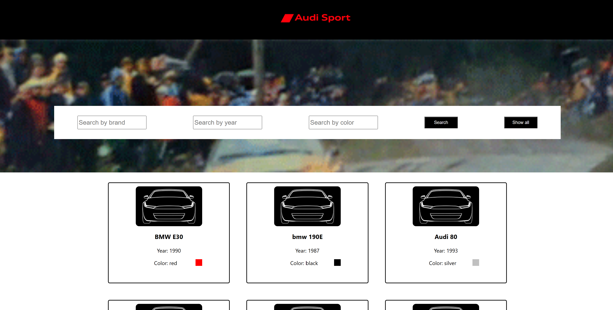

<h1 align="center">
  Simple car manager website using React
</h1>
<h3 align="center">
  This project was made for final exam of IT-Step
</h3>

## The main goal was to create car catalog website using react
The task name "Car catalog"
Level: Simple

Task had to have those possibilities:
1. Viewing information of all cars
2. View all cars from one brand
3. Viewing all cars of a certain year of manufacture
4. Viewing all cars of the same color
5. Viewing all cars of the same volume
6. Viewing all cars of the same price

Main possibilities was interpreted here.

The navigation filter on website is `Search pannel`

You can:
* Search by brand
* Search by year
* Search by color
* See all cars in catalog
   
### `most of website was written on react-router-dom modul `

  

### `How to use`:
* Git clone <url>
* In bash go to folder notebook
* npm install
* npm start

### Was used:
- JavaScript
- HTML/CSS
- React
- Router-dom

### This project was made by IT-Step student all information you can see here
[🌐 Go to IT-Step](https://if.itstep.org/)
